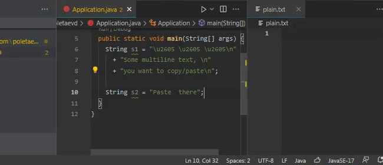

# Java String Literal Tools

## Features

- Copy unescaped value of string literal (or literal concatenation) to clipboard
- Paste plain text from clipboard into string literals. Each line is located in its own literal

## Usage

